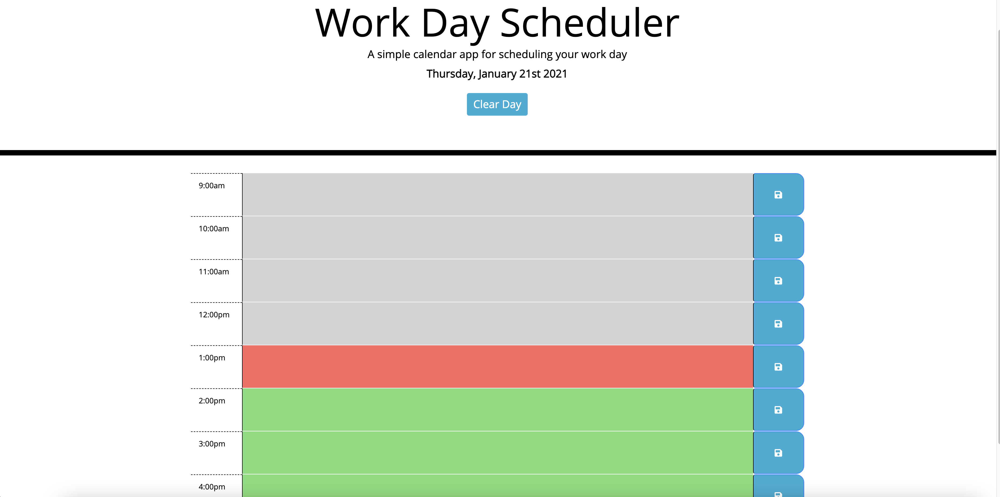

# Day Tracker: A Daily Planner Application
An app to keep track of daily to do lists and appointments.

## Link To Deployed Page
You can vist the live application [here](https://ahfotis.github.io/DayTracker/)

## Reference Image


## Application Overview
This application utilizes Moment.js to cycle through workday hours and track daily to dos. Features include:

    * Full date dislpayed in header.
    * "Clear Day" button also displayed in header to easily clear planner and local storage for next workday.
    * Hourly time is color coded: gray for past, red for present, and green for future. Accomplished by utilizing data-attributes and Moment.js.
    * Text field allows user to input whatever tasks need keeping track of. Inputs are saved on click of the corresponding save button at the end of the row.
    * Inputs are also sent to local storage so that to dos are still available upon page refresh. Only re-saving and input field or utilizing the "Clear Day" button will delete the content from local storage.


## Project Criteria

### User Story
```
AS AN employee with a busy schedule
I WANT to add important events to a daily planner
SO THAT I can manage my time effectively
```

### Acceptance Criteria
```
GIVEN I am using a daily planner to create a schedule
WHEN I open the planner
THEN the current day is displayed at the top of the calendar
WHEN I scroll down
THEN I am presented with time blocks for standard business hours
WHEN I view the time blocks for that day
THEN each time block is color-coded to indicate whether it is in the past, present, or future
WHEN I click into a time block
THEN I can enter an event
WHEN I click the save button for that time block
THEN the text for that event is saved in local storage
WHEN I refresh the page
THEN the saved events persist
```

## Credits
Starter code provided by Trilogy Education Services, LLC, a 2U, Inc. brand. Confidential and Proprietary. All Rights Reserved.
Moment.js utilized for date and time.

## License
MIT License

Copyright (c) [2021] [Anna Hickey Fotis]

